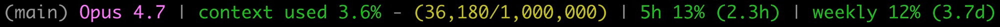

# Gists

A collection of standalone utilities and scripts.

## Contents

### claude-statusline/

Claude Code custom status line showing model name, percentage of the 1M
context window used (color-coded), exact token counts, session ID, and a
`user@host:dir (branch)` prefix.

```
jos@laptop:myproj (main) Opus 4.7 | context used 3.6% - (36,180/1,000,000) | 5h 13% (2.3h) | weekly 12% (3.7d)
```



**Gist:** https://gist.github.com/josmithiii/72bb219437e881521e72028bf01bb99a

### voice/

Voice-to-text transcription using OpenAI Whisper, with integrations for AI coding assistants and Emacs.

**Dependencies:** `openai-whisper`, `sox`, `ffmpeg`

```bash
voice                 # Record and print transcription
voice -c              # Copy to clipboard
voice 10              # Record for 10 seconds
voice claude          # Send directly to Claude Code
voice -l emacs        # Loop mode, insert into Emacs
```

**Environment variables:**
- `WHISPER_MODEL`: tiny/base/small/medium/large (default: base)
- `WHISPER_LANG`: Language code (default: en)

## License

MIT
